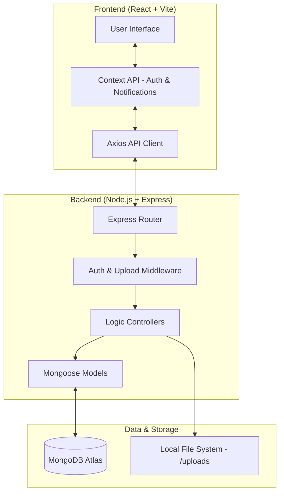

# Campus Hub - Student Freelance Marketplace

Campus Hub is a modern, full-stack freelance marketplace designed to connect students with Micro, Small, and Medium Enterprises (MSMEs). It facilitates a seamless workflow for posting tasks, applying for gigs, and managing internships or project-based work.

## 🏗️ System Architecture

The system follows a classic Client-Server architecture with a decoupled frontend and backend, communicating via a RESTful API.



### Core Components

- **Frontend**: Built with **React** and **Vite** for a fast development experience. **Tailwind CSS** is used for a premium, responsive design. **Context API** manages global state for authentication and real-time notifications.
- **Backend**: A **Node.js** and **Express** server handles business logic, authentication, and file processing.
- **Database**: **MongoDB Atlas** serves as the primary data store, using **Mongoose** for schema modeling.
- **Authentication**: **JWT (JSON Web Tokens)** are used for secure, stateless authentication across the platform.
- **File Handling**: **Multer** manages file uploads (Resumes, Business Logos, etc.), which are stored on the server and served statically.

---

## ⚙️ How the System Works

### 1. User Roles & Authentication
The system supports two primary roles:
- **Students**: Can browse tasks, apply for gigs, manage their work, and update their professional profiles (including resumes).
- **MSMEs**: Can post tasks, review applicants, and assign work to students.

Authentication is handled via a secure JWT flow. Upon login, a token is stored in the browser's `localStorage` and included in the `Authorization` header for all subsequent API requests.

### 2. Task Lifecycle
1. **Creation**: An MSME user posts a task with details like title, description, budget, and deadline.
2. **Discovery**: Students browse available tasks using advanced filters (category, type, budget).
3. **Application**: Students apply for tasks by providing a cover letter.
4. **Review & Assignment**: MSMEs view the list of applicants for their tasks and assign the task to the most suitable candidate.
5. **Execution**: Once assigned, the task status changes to `in-progress`, and the student can begin work.

### 3. Profile & Document Management
The system handles role-specific data:
- **Students**: Manage education details, skills, bio, and upload a resume/portfolio.
- **MSMEs**: Manage business descriptions, services offered, and upload a business logo or company profile.

### 4. Real-time Notifications
Users receive system notifications for critical actions, such as when a student applies for a task or when an MSME assigns a task to a student.

---

## 🛠️ Tech Stack

- **Frontend**: React, React Router, Tailwind CSS, Axios, Lucide React.
- **Backend**: Node.js, Express, Mongoose, JWT, Multer, CORS.
- **Database**: MongoDB Atlas.
- **Deployment**: Vercel (Frontend), Render (Backend).

---

## 📁 Project Structure

```text
campus-hub/
├── backend/
│   ├── src/
│   │   ├── config/         # Database configuration
│   │   ├── controllers/    # Business logic
│   │   ├── middleware/     # Auth and file upload logic
│   │   ├── models/         # Mongoose schemas
│   │   ├── routes/         # API endpoints
│   │   └── server.js       # Entry point
│   └── uploads/            # Stored files (Resumes, Logos)
├── frontend/
│   ├── src/
│   │   ├── components/     # Reusable UI components
│   │   ├── contexts/       # Auth and Notification state
│   │   ├── pages/          # Page-level components
│   │   ├── utils/          # API configuration
│   │   └── App.jsx         # Routing logic
│   └── public/             # Static assets
└── README.md
```

---

## 🚀 Getting Started

Refer to the [QUICKSTART.md](./QUICKSTART.md) for detailed instructions on setting up the local development environment.
